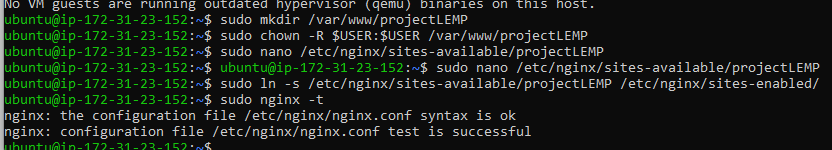

# LEMP-STACK-IMPLEMENTATION

The terms MEAN, MERN, LEMP, PERN, etc are often encountered while using the internet. These are web stacks consisting of a bundle of software and frameworks or libraries which are used for building full-stack web apps. A stack usually consists of a database, server-side and client-side technologies, a web server, a particular Operating system. Sometimes back-end technologies are cross-platform hence no particular OS.

LEMP is an open-source web application stack used to develop web applications. The term LEMP is an acronym that represents L for the Linux Operating system, Nginx (pronounced as engine-x, hence the E in the acronym) web server, M for MySQL database, and P for PHP scripting language.

- [Linux](https://phoenixnap.com/glossary/what-is-linux) Operating System
- [Nginx](https://nginx.org/en/) web server
- [MySQL](https://phoenixnap.com/kb/install-mysql-ubuntu-20-04) database management system
- [PHP](https://phoenixnap.com/kb/check-php-version) programming language

# How to Install LEMP Stack AWS

# Create an Ec2 instance 
*Select region (and launch a new EC2 instance of t2.micro family with Ubuntu Server 20.04 LTS (HVM)*

*Create a Key pair while creating the EC2 instance (download a .pem or .ppk key to ssh or use putty respectively to connect to the instance)*

*to connect to the Ec2 instance via ssh run the following command on power shell*

`ssh -i "task_one.pem" ubuntu@ec.<Public-IP>.compute-1.amazonaws.com`

# Step 1. Install Nginx Web Server

To update server's package index run:

`sudo apt update`

To install Nginx run the following command

`sudo apt install nginx -y`

To verify that nginx was successfully installed and is running as a service in Ubuntu, run:

`sudo systemctl status nginx`

 If  you see this output then, you have done everything correctly

 To check if we can access the webserver locally on our Ubuntu shell, run:

`curl http://localhost:80`
or
`curl http://127.0.0.1:80`

 This should be your output.

To test if our  Nginx server will respond to requests from the Internet, open a web browser of your choice and try to access following url

`http://<Public-IP-Address>:80`

 If you see this page, then your web server is now correctly installed and accessible through your firewall.

# Step 2. Installing Mysql

To install run:

`sudo apt install mysql-server -y`

After installation, log in to the MySQL console by typing:

`sudo mysql`


It’s recommended that you run a security script that comes pre-installed with MySQL. This script will remove some insecure default settings and lock down access to your database system. Before running the script, you will set a password for the root user, using mysql_native_password as default authentication method. We’re defining this user’s password as PassWord.1.

`ALTER USER 'root'@'localhost' IDENTIFIED WITH mysql_native_password BY 'PassWord.1';`

Exit the MySQL shell with:

`exit`

Start the interactive script by running:

`sudo mysql_secure_installation`

This command will ask if you want to configure the VALIDATE PASSWORD PLUGIN.
Note: Enabling this feature is something of a judgment call. If enabled, passwords which don’t match the specified criteria will be rejected by MySQL with an error. It is safe to leave validation disabled, but you should always use strong, unique passwords for database credentials.
Answer Y for yes, or anything else to continue without enabling.


If your answer is “yes”, you’ll be asked to select a level of password validation. It is advisable to pick 0 Keeping in mind that if you enter 2 for the strongest level, you will receive errors when attempting to set any password which does not contain numbers, upper and lowercase letters, and special characters, or which is based on common dictionary words e.g PassWord.1.
There are three levels of password validation policy:

`LOW	Length >= 8
MEDIUM Length >= 8, numeric, mixed case, and special characters
STRONG Length >= 8, numeric, mixed case, special characters and dictionary file
 
Please enter 0 = LOW, 1 = MEDIUM and 2 = STRONG: 1COPY`

If you enabled password validation, you’ll be shown the password strength for the root password you just entered and your server will ask if you want to continue with that password. If you are happy with your current password, enter Y for “yes” at the prompt:

`Estimated strength of the password: 100`

For the rest of the questions, press Y and hit the ENTER key at each prompt. This will prompt you to change the root password, remove some anonymous users and the test database, disable remote root logins, and load these new rules so that MySQL immediately respects the changes you have made.
When you’re finished, test if you’re able to log in to the MySQL console by typing

`sudo mysql -u root-p`

This will prompt you to type in your password for login


To exit Msql type:

`exit`

# Step 3. Installing PHP

You’ll need to install ***php-fpm***, which stands for “PHP fastCGI process manager”, and tell Nginx to pass PHP requests to this software for processing. Additionally, you’ll need ***php-mysql***, a PHP module that allows PHP to communicate with MySQL-based databases. Core PHP packages will automatically be installed as dependencies.

To install these 2 packages at once, run: 

`sudo apt install php-fpm php-mysql -y`

# STEP 4. Configuring  NGINX to use PHP Processor

Create the root web directory for your domain as follows:

`sudo mkdir /var/www/projectLEMP`

Assign ownership of the directory with the $USER environment variable, which will reference your current system user:

`sudo chown -R $USER:$USER /var/www/projectLEMP`

Then, open a new configuration file in Nginx’s ***sites-available*** directory using your preferred command-line editor. Here, we’ll use[Nano](https://help.ubuntu.com/community/Nano) 

`sudo nano /etc/nginx/sites-available/projectLEMP`

This will create a new blank file. Paste in the following bare-bones configuration:

``` 
#/etc/nginx/sites-available/projectLEMP

server {
	listen 80;
	server_name projectLEMP www.projectLEMP;
	root /var/www/projectLEMP;
 
	index index.html index.htm index.php;
 
	location / {
    	try_files $uri $uri/ =404;
	}
 
	location ~ \.php$ {
    	include snippets/fastcgi-php.conf;
    	fastcgi_pass unix:/var/run/php/php8.1-fpm.sock;
 	}
 
	location ~ /\.ht {
    	deny all;
	}
 
}
```
Activate your configuration by linking to the config file from Nginx’s sites-enabled directory:

`sudo ln -s /etc/nginx/sites-available/projectLEMP /etc/nginx/sites-enabled/`

This will tell Nginx to use the configuration next time it is reloaded. 

You can test your configuration for syntax errors by typing:

`sudo nginx -t`



We  need to disable default Nginx host that is currently configured to listen on port 80, for this run:

`sudo unlink /etc/nginx/sites-enabled/default`

Reload Nginx to apply the changes:

`sudo systemctl reload nginx`

Website is now active, but the web root /var/www/projectLEMP is still empty. Create an index.html file in that location so that we can test that our new server block works as expected:

`sudo echo 'Hello LEMP from hostname' $(curl -s http://169.254.169.254/latest/meta-data/public-hostname) 'with public IP' $(curl -s http://169.254.169.254/latest/meta-data/public-ipv4) > /var/www/projectLEMP/index.html`

Now go to your browser and try to open your website URL using IP address:

`http://<Public-IP-Address>:80`


# STEP 5.  Testing  PHP with Nginx
To validate that Nginx can correctly handle .php files off to your PHP processor. We will ceate a test PHP file in our document root. Open a new file called info.php within our document root in our nano text editor:


`sudo nano /var/www/projectLEMP/info.php`

Type or paste the following lines into the new file. 

```
<?php
phpinfo();
```
We can now access this page in our web browser by visiting the domain name or public IP address we’ve set up in our Nginx configuration file, followed by /info.php:

`http://`server_domain_or_IP`/info.php`


After checking the relevant information about our PHP server through that page, it’s best to remove the file you created as it contains sensitive information about our PHP environment and your Ubuntu server. We can use rm to remove that file:

`sudo rm /var/www/your_domain/info.php`

Files can be regenerated subsequently

# Step 6.  Retrieving data from MySQL database with PHP

In this step we are going to  create a test database (DB) with simple "To do list" and configure access to it, so the Nginx website would be able to query data from the DB and display it.

The first step is to connect to the MySQL console using the root account:

`sudo mysql`

To create a new database, run the following command from your MySQL console:

`CREATE DATABASE  example_database;`

We can now create a new user and grant him full privileges on the database that has just been created.
The following command creates a new user named example_user, using mysql_native_password as default authentication method. We’re defining this user’s password as password, but you should replace this value with a secure password of your choice.

`CREATE USER 'example_user'@'%' IDENTIFIED WITH mysql_native_password BY 'password';`

 The following command grants this user permission over the example_database database:

`GRANT ALL ON example_database.* TO 'example_user'@'%'`

Exit mysql with

`exit`

We can test if the new user has the proper permissions by logging in to the MySQL console again, this time using the custom user credentials:

`mysql -u example_user -p`

This command will prompt for the  password that was used when creating the user.

`SHOW DATABASES;`


Next, we’ll create a test table named todo_list. From the MySQL console,

Run the next command to move into the created database

`USE example_database`
The output for this command is database changed.

To create a table called todo_list run following command

CREATE TABLE todo_list (
mysql> item_id INT AUTO_INCREMENT,
mysql> content VARCHAR(255),
mysql> PRIMARY KEY(item_id)    
mysql> );

We will run the next command to insert  rows of content in the test table. We may repeat the next command a few times, using different VALUES:

`INSERT INTO example_database.todo_list (content) VALUES ("My first important item");`

To confirm that the data was successfully saved to our table, we will run:

`SELECT * FROM example_database.todo_list;`


`exit`

It is now time to  create a PHP script that will connect to MySQL and query for our content. Create a new PHP file in the custom web root directory using our preferred editor.

`nano /var/www/projectLEMP/todo_list.php`

The following PHP script connects to the MySQL database and queries for the content of the todo_list table, displays the results in a list. If there is a problem with the database connection, it will throw an exception.

Copy this content into your todo_list.php script:

```
<?php
$user = "example_user";
$password = "password";
$database = "example_database";
$table = "todo_list";
 
try {
  $db = new PDO("mysql:host=localhost;dbname=$database", $user, $password);
  echo "<h2>TODO</h2><ol>";
  foreach($db->query("SELECT content FROM $table") as $row) {
	echo "<li>" . $row['content'] . "</li>";
  }
  echo "</ol>";
} catch (PDOException $e) {
	print "Error!: " . $e->getMessage() . "<br/>";
	die();
}
```
Save and close the file after editing.

Page can now be accessed in our web browser by visiting the domain name or public IP address configured for our website, followed by /todo_list.php:

`http://<Public_domain_or_IP>/todo_list.php`

 once you get this output then That means your PHP environment is ready to connect and interact with your MySQL server.


